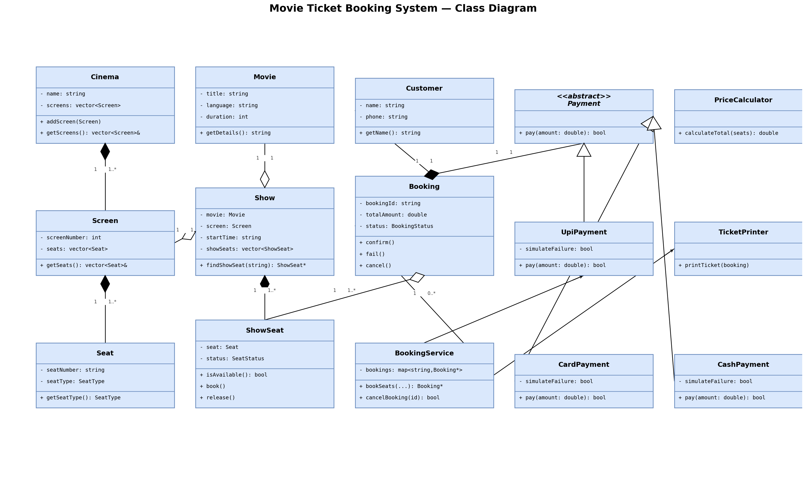
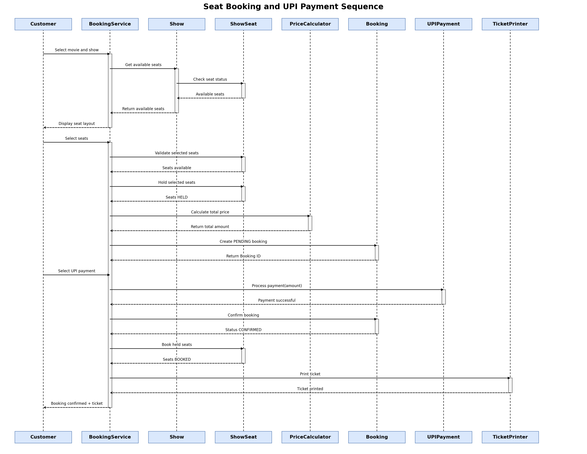

# Movie Ticket Booking System

A menu-driven C++ console application for a single-cinema movie ticket booking
system, built for **TCS-504 (System Design)** — Assignment 1.

## Features

- List movies currently playing and their shows (screen + time)
- View a show's seat layout (AVAILABLE / BOOKED)
- Book one or more seats for a show, with rejection of already-booked seats
- Price seats by type: SILVER ₹150, GOLD ₹250, PLATINUM ₹400
- Pay by UPI, Card, or Cash — a failed payment never confirms a booking
- Print a ticket (booking id, movie, screen, time, seats, total)
- Cancel a booking and release its seats back to AVAILABLE

## Build & run

```bash
g++ -std=c++17 -Wall src/main.cpp -o booking
./booking
```

> One class per file, no header files — each `.cpp` is self-contained with a
> `#pragma once` guard, and only `main.cpp` is compiled as the single
> translation unit.

## Project structure

```
src/    14 files — 13 classes (one per file) + main.cpp
docs/   design write-up (DESIGN.md) + class diagram and sequence
        diagram as PNG images
```

## Design docs

- `docs/DESIGN.md` — full write-up: requirements (FR/NFR), noun-verb
  analysis, class responsibilities, relationships, and SOLID mapping
- `docs/movie_booking_class_diagram.png` — full class diagram (15 classes,
  composition/aggregation/association/inheritance relationships)
- `docs/seat_booking_sequence_diagram.png` — sequence diagram for
  "customer books 1 seat and pays by UPI"

### Class diagram



### Sequence diagram — book 1 seat and pay by UPI



## OOP concepts demonstrated

Encapsulation, abstraction (`Payment`), inheritance (`UpiPayment` /
`CardPayment` / `CashPayment`), runtime polymorphism (`Payment*` dispatch),
compile-time polymorphism (overloaded constructors), static members
(`Booking::nextBookingId`), composition, aggregation, and association — see
inline comments in `src/` for where each applies.

## Edge cases handled

1. Booking an already-booked seat → rejected, no state changes
2. A failed payment → booking not confirmed, seats released
3. Cancelling a booking → seats return to AVAILABLE
4. Invalid seat number or menu choice → clear message, no crash